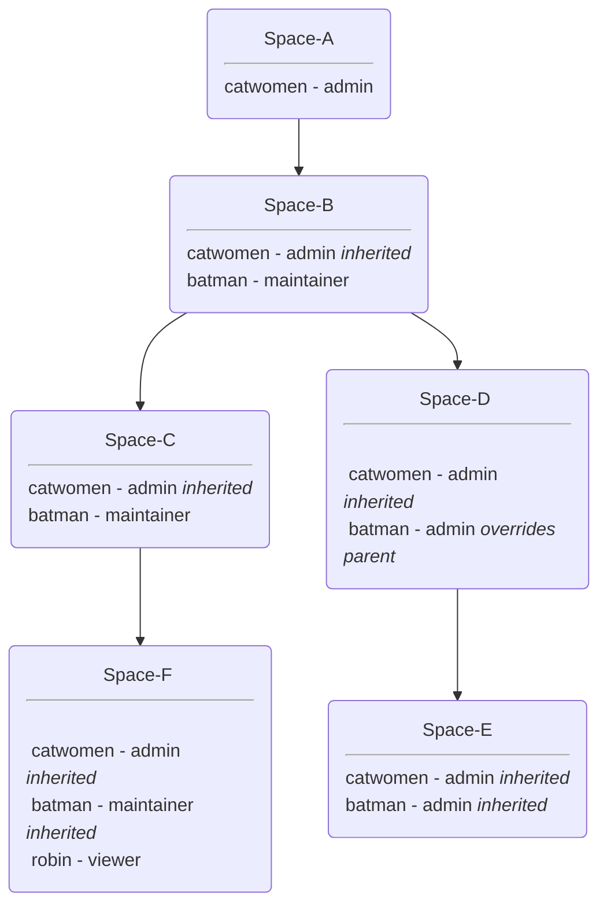

## SpaceBinding lister test 

The spacebinding lister test verifies that `ListForSpace` function returns the expected spacebindings for a given space resource.

At a high level, we want to make sure that given a specific space, the function covers the following requirements:

- we get spcebindings resources for users that have access to that space
- we want to make sure the spacebindings are being inherited from the parent spaces
- spacebindings on the sub-space will override those on the parent space for the same MUR
- a user can have only one role (or no access) in a specific Space

Following is the test data hierarchy that we build upfront to verify that the function behaves as expected:

Note: use mermaid plugin for your IDE or go to https://mermaid.live/ and paste the mermaid code

Given the above hierarchy the expected result for each space should be:

|          |  Space-A  |   Space-B   |  Space-C  | Space-D | Space-E |  Space-F  |
|:--------:|:---------:|:-----------:|:---------:|:-------:|:-------:|:---------:|
| catwomen |   admin   |    admin    |   admin   | admin | admin |   admin   |
|  batman  | no access |  maintainer | maintainer | admin | admin | no access | 
|  robin   | no access | no access | no access | no access | no access | viewer |
